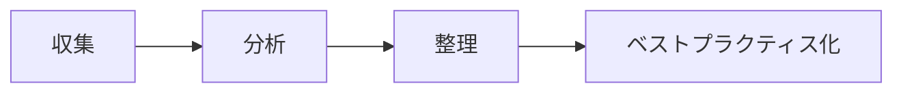

# Know-how Vault

Know-how Vault は、ノウハウの収集から分析・整理・ベストプラクティス化までを支援するローカル向けアプリです。

## ✨ できること

- ノウハウの収集
- テーマ管理
- 分析と整理
- ベストプラクティス化

## 🧭 ワークフロー



## 🛠️ ローカル起動

### Dev Container を使う場合

1. VS Code でこのフォルダを開く
2. 「Reopen in Container」を実行する
3. ターミナルで次を実行する

```bash
npm install
npm run dev
```

### 直接実行する場合

```bash
npm install
npm run dev
```

## 📦 主要構成

| 項目 | 内容 |
| --- | --- |
| フロントエンド | Vite + React + TypeScript |
| バックエンド | Hono + TypeScript |
| データ保存 | SQLite via sql.js |
| テスト | Node.js test runner |

## 🧪 テスト

```bash
npm --prefix backend run test
```

## � PR について

- 変更内容は feature ブランチで整理してから PR にまとめます
- CI で build とテストを確認します

## �🔐 注意事項

- 重要な情報は Git にコミットしないでください
- ローカル実行時の DB はローカルファイルに保存されます
