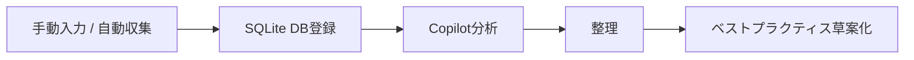

# Know-how Vault

Know-how Vault は、ノウハウの収集から分析・整理・ベストプラクティス化までを支援するアプリです。  
今回の構成では **ブラウザ保存ではなくバックエンドの SQLite DB 登録** を前提にしつつ、**自動収集** と **Copilot / GitHub Models を使った分析・草案作成** に対応しています。

## ✨ できること

- 手動でノウハウを DB 登録
- テーマ管理
- RSS / Atom からの自動収集
- Copilot を使った分析
- Copilot を使ったベストプラクティス草案生成

## 🧭 ワークフロー



## 📦 主要構成

| 項目 | 内容 |
| --- | --- |
| フロントエンド | Vite + React + TypeScript |
| バックエンド | Hono + TypeScript |
| データ保存 | SQLite via sql.js |
| 自動収集 | RSS / Atom |
| AI 連携 | GitHub Models API |
| テスト | Node.js test runner |

## 🔐 環境変数

プロジェクトルートに `.env` を作成し、必要に応じて次を設定します。

```bash
COPILOT_GITHUB_TOKEN=your_github_token_with_models_read
GITHUB_MODELS_MODEL=openai/gpt-4.1-mini
PORT=8787
AUTO_COLLECT_LIMIT=5
FRONTEND_ORIGIN=http://localhost:5173
```

- `COPILOT_GITHUB_TOKEN` を設定すると、分析とベストプラクティス草案を Copilot / GitHub Models で生成します
- 未設定の場合はローカル補完ロジックにフォールバックします

## 🛠️ ローカル起動

### Dev Container を使う場合

1. VS Code でこのフォルダを開く
2. **Reopen in Container** を実行する
3. ターミナルで次を実行する

```bash
npm install
npm run dev
```

### 直接実行する場合

```bash
npm install
npm run dev
```

- フロントエンド: `http://localhost:5173`
- バックエンド API: `http://localhost:8787/api`

## 🚀 デプロイ

### DB 登録を伴う本番構成

GitHub Pages **だけ** ではバックエンドと SQLite DB を動かせないため、DB 登録を使う場合は **Node.js が動くホスティング** が必要です。

このリポジトリには `Dockerfile` を含めているため、コンテナ対応のホスティングへそのまま載せられます。

```bash
docker build -t knowhow-vault .
docker run -p 8787:8787 --env-file .env knowhow-vault
```

バックエンドは `frontend/dist` を配信するため、単一サービスとして動かせます。

### GitHub Pages を使う場合

GitHub Pages は **フロントエンドのみ** の配信です。DB 登録を使うには、別途バックエンドを公開し、GitHub の Repository Variables に `VITE_API_BASE_URL` を設定してください。

## 🧪 テスト

```bash
npm --prefix backend run test
```

## 📌 補足

- 自動収集は RSS / Atom ソースを登録して実行します
- 収集時は `external_ref` を使って重複登録を避けます
- 重要な情報やトークンは Git にコミットしないでください
